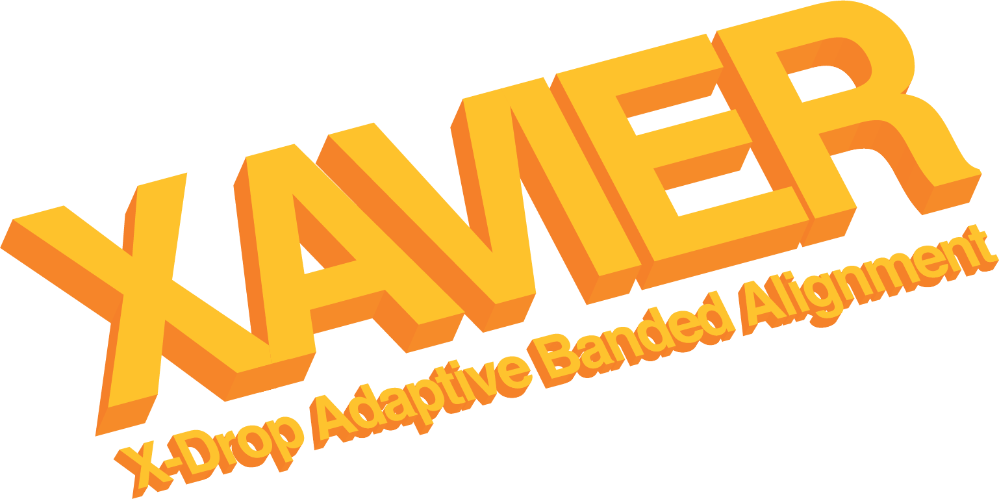

<p align="justify">
XAVIER computes high-performance x-drop adaptive banded pairwise alignment exploiting  instruction level parallelism via Single-Instruction-Multiple-Data (SIMD) operations. Our implementation uses a narrow bandwidth that appreciably improves performance reducing the search space for the optimal alignment. The adaptive mechanism enables Xavier to find the optimal alignment between related sequences even when the error rate is as high as 50%.
</p>

## Requirement

XAVIER requires **[C++17](https://en.cppreference.com/w/cpp/17)**.

## Build

```
git clone https://github.com/giuliaguidi/xavier
cd xavier
git submodule init
git submodule update
make
```

## Build and Install for Integration into Larger Projects

You need to install [meson](https://mesonbuild.com/) and [ninja](https://ninja-build.org/).
Once installed:

```
mkdir build && cd build
meson && ninja
```
or
```
meson build .
ninja -C build
```

## API
You can find a demo on how to run/call XAVIER in `/examples/demo.cpp`:
```
cd examples
make
./demo
```
## Copyright Notice

<p align="justify">
Xavier: High-Performance X-Drop Adaptive Banded Pairwise Alignment (Xavier) Copyright (c) 2019, The
Regents of the University of California, through Lawrence Berkeley National
Laboratory (subject to receipt of any required approvals from the U.S.
Dept. of Energy).  All rights reserved.
</p>

<p align="justify">
If you have questions about your rights to use or distribute this software,
please contact Berkeley Lab's Intellectual Property Office at
IPO@lbl.gov.
</p>

<p align="justify">
NOTICE.  This Software was developed under funding from the U.S. Department
of Energy and the U.S. Government consequently retains certain rights.  As
such, the U.S. Government has been granted for itself and others acting on
its behalf a paid-up, nonexclusive, irrevocable, worldwide license in the
Software to reproduce, distribute copies to the public, prepare derivative
works, and perform publicly and display publicly, and to permit other to do
so.
</p>

## Acknowledgments

Funding provided in part by DOE ASCR through the [Exascale Computing Project](https://www.exascaleproject.org/) and computing provided by [NERSC](https://www.nersc.gov/).

